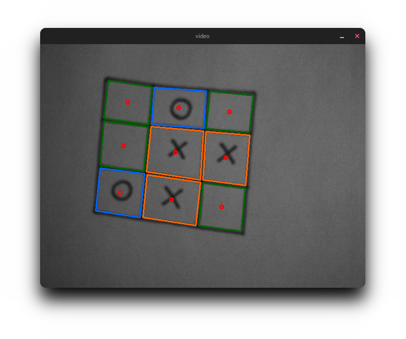

# Morpion
A real time python image processor for Tic-tac-toe.

## Requirements
* Python 2
* OpenCV 2
* [zhangsuen](https://github.com/linbojin/Skeletonization-by-Zhang-Suen-Thinning-Algorithm)
* Numpy

## How it works
1. Prepares the input picture and builds its skeleton.
2. Looks for a square and its inner cells.
3. For each cell...  
3.1. Looks for a circle, if yes, register it as a circle.  
3.2. If not a circle, looks if the cell is filled (at this point, whatever is considered as a cross).  
3.3. If empty, consider the cell empty.
4. Draw the output.

## To do
- Implement a solver.
- Improve the recognizer (vignetting can occur with low quality webcams, which reduces the recognition accuracy).
